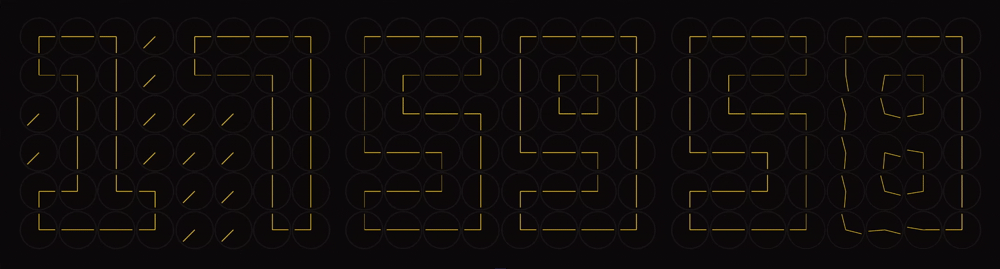

# Clock Made of Clocks

A digital clock created from smaller analog clocks, built with TypeScript and Next.js



Inspired by [githyperplexed](https://github.com/githyperplexed/clock-of-clocks)

## Tech Stack

-   **Framework:** [Next.js](https://nextjs.org/)
-   **Language:** [TypeScript](https://www.typescriptlang.org/)
-   **Styling:** [Tailwind CSS](https://tailwindcss.com/)

## Getting Started

### Prerequisites

-   Node.js
-   npm

### Installation & Usage

1.  Clone the repository

    ```sh
    git clone https://github.com/Murmeltierchen/clock-made-of-clocks
    ```

2.  Navigate into the project

    ```sh
    cd clock-made-of-clocks
    ```

3.  Install NPM packages

    ```sh
    npm install
    ```

4.  Run the development server

    ```sh
    npm run dev
    ```

5.  Open [http://localhost:3000](http://localhost:3000) with your browser
